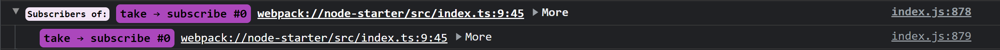
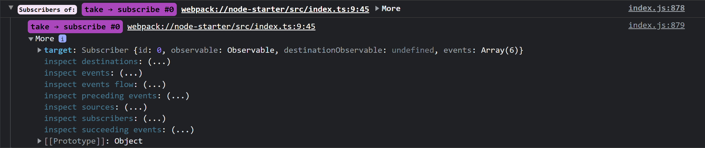
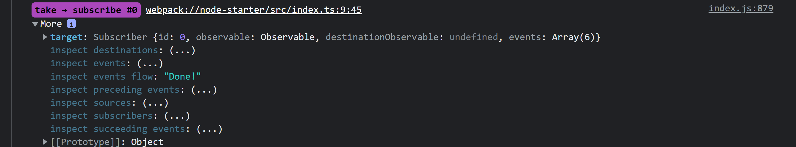
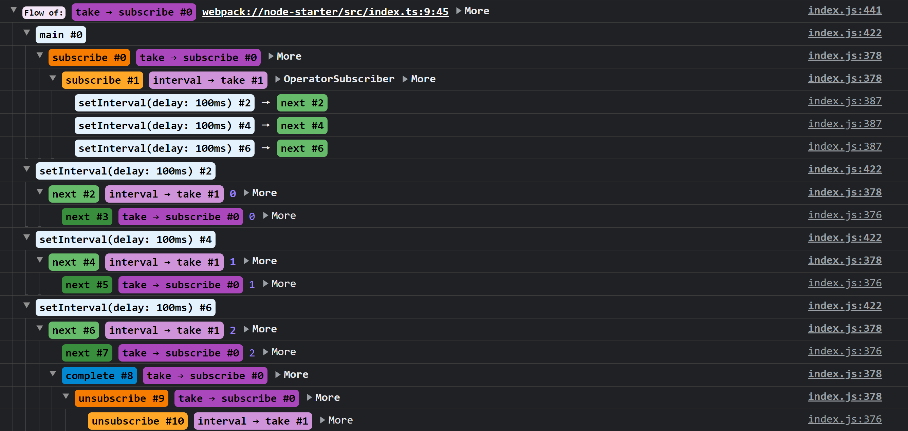

# RxJS Insights

[](https://badge.fury.io/js/@rxjs-insights%2Finstrumentation)
[](https://github.com/ksz-ksz/rxjs-insights/blob/master/LICENSE)

RxJS Insights is a toolset that helps you debug the RxJS Observables.

**✨ Developer friendly**: Easy to setup. Easy to use.

**✨ Comprehensive**: Collects all types of events that happen inside RxJS.

**✨ Unobtrusive**: Does not require source code modification to be useful.

RxJS Insights gathers the data about:

* constructors (e.g. `Observable`, `Subject`, etc.),
* creators (e.g. `of`, `merge`, etc.),
* operators (e.g. `map`, `delay`, etc.),
* subscriptions,
* subscription chains (i.e. subscriptions created by other subscriptions),
* events:
  * notification events (i.e. `next`, `error` and `complete`),
  * subscription events (i.e. `subscribe` and `unsubscribe`),
* event relations (i.e. events caused by other events).

Try it out on [StackBlitz ⚡](https://stackblitz.com/edit/rxjs-insights-playground)

## Installation

### Instrumentation

Setting up instrumentation requires:
* installing the instrumentation package that matches the installed version of the `rxjs` package, e.g. `@rxjs-insights/rxjs7`,
* intercepting resolution of a few modules, which can be achieved either by installing appropriate plugin, e.g. `@rxjs-insights/plugin-webpack5`, or by setting it up manually.

#### RxJS v6

```
npm install --save-dev @rxjs-insights/rxjs6
```

#### RxJS v7

```
npm install --save-dev @rxjs-insights/rxjs7
```

#### Angular 12+

1. Install the `@rxjs-insights/plugin-webpack5` package
```
npm install --save-dev @rxjs-insights/plugin-webpack5
```

2. Install the `@angular-builders/custom-webpack` package
```
npm install --save-dev @angular-builders/custom-webpack
```

3.  Modify `angular.json`

* Set `projects.<project>.architect.build.builder` to `@angular-builders/custom-webpack:browser`.
* Set `projects.<project>.architect.build.configurations.development.customWebpackConfig` to:
```json
{
  "path": "development.config.js"
}
```
* Set `projects.rxjs-insights-angular.architect.serve.builder` to `@angular-builders/custom-webpack:dev-server`.

4. Create the `development.config.js` file

* Place it next to the `angular.json` file.
* Set it's content to:
```js
const { RxjsInsightsPlugin } = require('@rxjs-insights/plugin-webpack5');

module.exports = {
  plugins: [
    new RxjsInsightsPlugin()
  ]
}
```

#### Webpack 5

1. Install the `@rxjs-insights/plugin-webpack5` package
```
npm install --save-dev @rxjs-insights/plugin-webpack5
```

2. Add the plugin to the Webpack configuration
```js
// webpack.config.js

const { RxjsInsightsPlugin } = require('@rxjs-insights/plugin-webpack5');

module.exports = {
  (...)
  plugins: [
    new RxjsInsightsPlugin()
  ]
  (...)
}
```

#### esbuild

1. Install the `@rxjs-insights/plugin-esbuild` package
```
npm install --save-dev @rxjs-insights/plugin-esbuild
```

2. Add the plugin to the esbuild configuration
```js
// build.js

const esbuild = require('esbuild');
const { rxjsInsightsPlugin } = require('@rxjs-insights/plugin-esbuild');

esbuild.build({
  (...)
  plugins: [rxjsInsightsPlugin()]
  (...)
});

```

### Zone.js (optional)

By default, RxJS Insights tracks async actions by instrumenting schedulers.
This approach is limited, as it does not allow tracking actions triggered by direct `setTimeout` and `setInterval` calls, REST requests, DOM events, etc.
To enable tracking all kinds of async actions, Zone.js needs to be installed.

> Zone.js is already installed if you are using Angular.

1. Install the `zone.js` package
```
npm install --save-dev zone.js
```

2. Import `zone.js` in your app

It's important to do it before the `rxjs` module runs (i.e. before it's imported for the first time). It can be achieved by adding the `zone.js` import to the `polyfills.js` file, which is typically run before the main module: 
```js
// polyfills.js

import "zone.js"
```

Another approach involves overriding the `installModule` path in the plugin and adding the `zone.js` import there:
```js
// install.js

import "zone.js";
import "@rxjs-insights/rxjs7";
```

```js
// webpack.config.js

new RxjsInsightsPlugin({installModule: path.join(__dirname, 'install.js')});
```

## Console

The `@rxjs-insights/console` package provides a set of functions that allows to analyze the collected data right in the browser console in understandable and interactive form.

### Installation

1. Install the `@rxjs-insights/console` package
```
npm install --save-dev @rxjs-insights/console
```

2. Expose the console inspector in a global variable (optional)

Sometimes it's useful to have access to the console inspector functions during debugging.

```ts
import * as rxjsInsightsConsole from "@rxjs-insights/console";

(window as any).rxjsInsightsConsole = rxjsInsightsConsole;
```

```js
// later, during debugging

rxjsInsightsConsole.events(someObservableOrSubscription);
```

### Usage

The `@rxjs-insights/console` package exports a few functions that allow to analyze the collected data.
Every function accepts a target `Observable` or `Subscription` as a parameter.

* **subscribers** - shows the subscriber(s) of the target,
* **sources** - shows the subscriber(s) of the target; for each subscriber shows the source subscribers tree,
* **destinations** - shows the subscriber(s) of the target; for each subscriber shows the destination subscribers tree,
* **events** - shows the events of the target,
* **precedingEvents** - shows the events of the target; for each event shows the chain of events that triggered the given event, 
* **succeedingEvents** - shows the events of the target; for each event shows the tree of events that were triggered by the given event,
* **flow** - shows an ordered tree of events related with the target events.

A good starting point is to use the `subscribers` function:



From that point it's possible to interactively explore other options by expanding the `More` object:



and invoking one of the getters:




## Future work

* 🧩 Create plugins for other bundlers (e.g. Rollup, Parcel, etc.), 
* 🧩 Create a devtools extension! 😎


