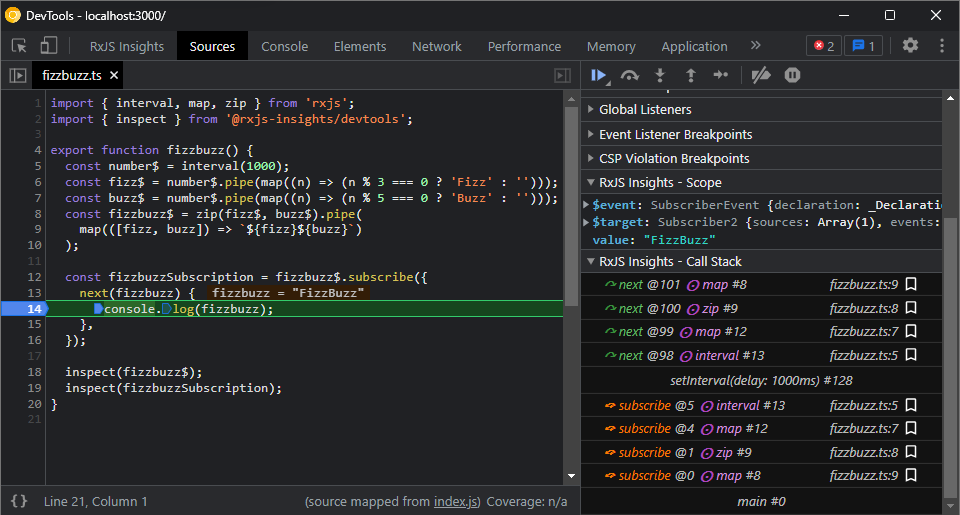
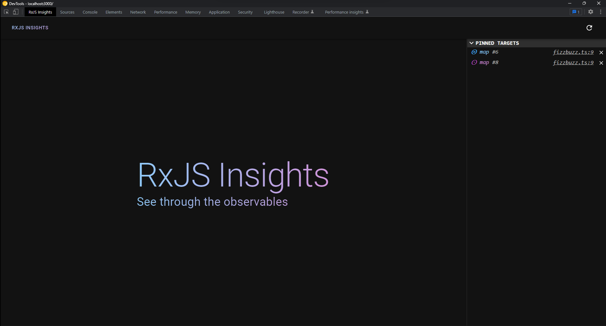
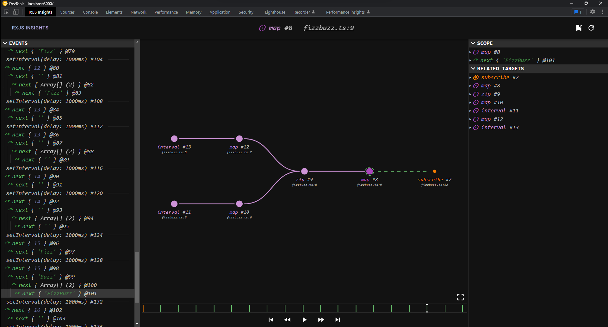

# Devtools usage

## Inspecting observables and subscribers

In order to inspect an observable or a subscriber in the RxJS Insights Devtools, it needs to be passed to the `inspect` function:

```ts
import { inspect } from '@rxjs-insights/devtools'

const observable = interval(1000);
const subscriber = observable.subscribe();

inspect(observable);
inspect(subscriber);
```

The observable can also be "piped through" the `inspect` function:

```ts
import { inspect } from '@rxjs-insights/devtools'

const observable = interval(1000).pipe(
  inspect, // note that it's not a function call as with other operators!
).subscribe();
```

The target of the `inspect` function will be sent to the RxJS Insights Devtools Panel and saved as a "pinned target", so that it can be found easily.

## Using the RxJS Insights Devtools Sources Panel Extension



RxJS Insights Devtools are adding a new side panel to the Sources Panel.
When the code execution is stopped (e.g. a breakpoint is hit), the `RxJS Insights - Call Stack` panel shows the RxJS events down the stack.
After clicking a particular entry, the `RxJS Insights - Scope` panel updates and allows to inspect the event (next, error, complete, subscribe, unsubscribe), the target (subscriber or observable/subject), and the emitted value (for the next event), emitted error (for the error event), or subscriber (for the subscribe event).
If the target source code location is known, clicking an entry opens this location in the sources panel.

The bookmark button that is present next to every entry, allows for pinning the target associated with the entry in the RxJS Insights Devtools Panel so that it can be accessed and inspected later.

## Using the RxJS Insights Devtools Panel



### Symbols and colors

The RxJS Insights is using symbols and colors to distinguish between different types of targets and events.

Targets: 

*  ⊙ - subscriber
*  ⊚ - observable
*  ⦿ - caller (e.g. subscribe, connect, etc.)

Events:
*  ↷ - next
*  ↷ - error
*  ↷ - complete
*  ⤽ - subscribe
*  ⤼ - unsubscribe


### Dashboard view

The devtools dashboard view is listing all the targets (subscribers and observables) that were previously pinned using the `inspect` function or the bookmark button in the sources panel extension.
If the target source location is known, it will be shown along with the target entry.
Clicking it will open the sources panel.
Clicking anywhere else on the target entry will open the inspection view.

### Analysis view



The devtools analysis view shows the data in the context of:
* the selected target,
* the selected event (time).
* the visible targets (i.e. visible on a graph at any point in time).

#### Events Panel

The Events Panel (left panel) shows all the events that are relevant for the current context.
It also shows all the tasks (e.g. setInterval) in which the events occurred.
If an event entry is grayed out, the target associated with the event is not currently visible.
If the event entry contains a little arrow on the right, the event is asynchronous (i.e. happened in a different task).
Clicking an event selects it, which modifies the analysis view context.

#### Context Panel

The Context Panel (right panel) shows the selected target, selected event, and all the targets related to the currently selected target.
This panel allows for inspecting the object trees of the listed targets and events.
In particular, it's possible to inspect the emitted values and errors (available under the selected event's object tree).
Every target and event in the object tree has an associated `Focus` button (i.e. `Focus observable`, `Focus subscriber`, `Focus event`).
Clicking this button selects the target or event, which modifies the analysis view context.

#### Graph Panel

The Graph Panel (main panel) shows a graph of targets.
The middle node represents a selected target.
The nodes on the left represents the source targets, i.e. the targets that the source target subscribes to (directly or indirectly).
The nodes on the right represents the destination targets, i.e. the targets that subscribes to the selected target (directly or indirectly).

There are a few actions available for every node either via click (+ modifiers) or the context menu.
* Focus (CTRL+Click) - selects the target associated with the node (modifies the analysis view context),
* Expand (Click) - expands the node and shows the nodes directly related to it (modifies the analysis view context),
* Expand all - expands the node recursively and shows the nodes directly or indirectly related to it (modifies the analysis view context),
* Collapse (Click) - collapses the node and hides the nodes directly related to it (modifies the analysis view context),
* Collapse all - collapses the node recursively and hides the nodes directly or indirectly related to it (modifies the analysis view context),
* Go to source - opens the target location in the Sources Panel.

> Tip: By default, the whole graph will be displayed in the viewport.
This behavior can be changed so that only the active target(s) are focused.
It can be done by clicking the "Follow event" button in the bottom right corner.

> Note: The graph shown actually a double tree with a root in the selected target.
> This means that a particular target might correspond to multiple graph nodes (e.g. when the source target subscribes twice to the same Subject, the subject will be shown twice in the graph).

#### Timeline Panel

The Timeline Panel (bottom panel) shows the event markers displayed on the timeline.
Clicking on the timeline will select the event closes to the selected time, which modifies the analysis view context.
The panel also features a set of controls that allows for navigating through the events:
* select first event,
* select previous event,
* play/pause events replay,
* select next event,
* select last event.
